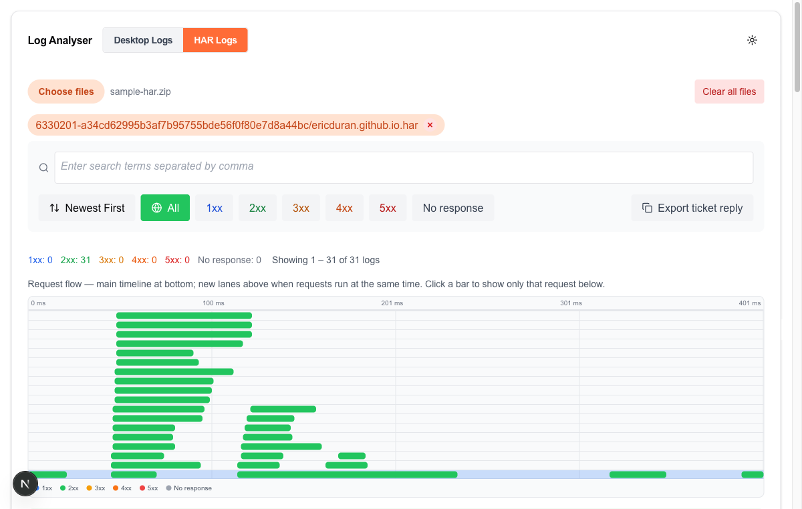

# Log Analyser

Log Analyser turns a wall of Postman Desktop logs (or a HAR capture) into something you can actually triage. This quick start walks through uploading a file, narrowing down to what matters, and the two power buttons that save the most time on a ticket: pulling workspace IDs and exporting a ready-made ticket reply. HAR mode gets a quick callout at the end.

**URL:** <https://log-analyser-2.vercel.app/>

---

## 1. Upload

Click **Choose files**. Accepts:

- `.log` (Postman Desktop format)
- `.har` (switch to **HAR Logs** at the top first)
- Any archive: `.zip / .rar / .7z / .tar / .gz / .tgz / .bz2 / .xz`

Multi-file uploads work. macOS `__MACOSX/` and `.DS_Store` noise is auto-skipped.

You land on the default view: **Errors** filter active, newest first.

---

## 2. Narrow down

- **Level**: All / Errors / Warnings / Info (multi-select to OR them)
- **Search**: type a term + `Enter` to add as a tag; backspace removes; multiple tags OR'd
- **Date range**: `YYYY-MM-DD` start / end (either side optional)
- **Scope**: **All Files** aggregates across pills, **Current File** restricts to the selected one

The "Showing N of M" counter tells you how aggressive your filter is.

---

## 3. Power buttons

### Get workspace IDs

Pulls every workspace UUID out of the logs.

- Click any ID → opens that workspace in **Support Dashboard**
- Click the filter icon next to an ID → filters the log view to just that workspace's lines
- **Errors only** → narrows the list to UUIDs that appear in error-level entries
- **Copy all** → newline-separated list to clipboard

### Export ticket reply

Generates a markdown summary of your current view: file list, time range, severity counts, top patterns, extracted workspace IDs. Ready to paste into a ticket reply.

- **Include filtered log entries** → embeds up to 50 of the filtered log lines too
- **Copy markdown** / **Download .md**

---

## 4. HAR mode

Toggle **HAR Logs** at the top to view `.har` captures instead. Filters swap to HTTP status buckets: `1xx / 2xx / 3xx / 4xx / 5xx / No response`.

A request timeline appears above the entries. Bars on the same lane ran one after another; bars on different lanes ran in parallel. Click any bar to filter the list below to just that request.

Each request card shows the method, full URL, status, and timing breakdown (DNS / Connect / SSL / TTFB / Receive). The metadata line shows just the host so you can scan for which service is being hit.

---

Source / feedback: <https://github.com/postmanEamon/Log-Analyser-2>
